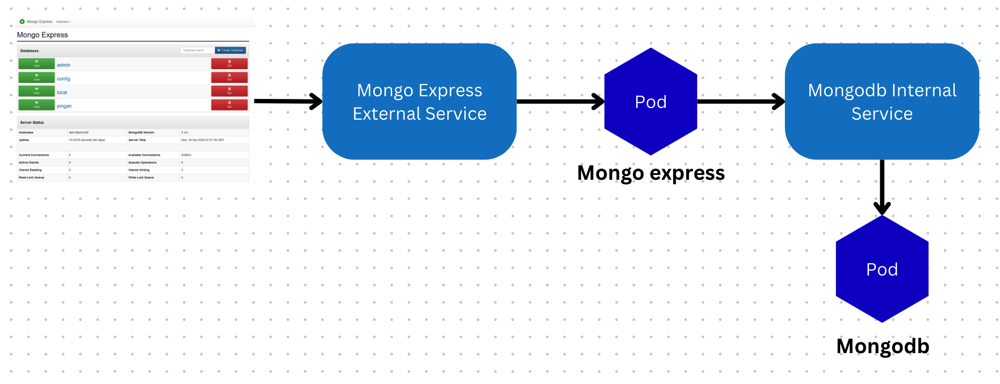

# Project Overview

Develop a project using MongoDB with an Express UI.
This project involves deploying MongoDB and MongoDB Express,
and includes two services: `mongodb-service` (internal) and `mongo-express-service` (external).
It configures secrets for username and password to connect to MongoDB from Mongo Express
and uses a ConfigMap for MongoDB connection configuration.



# Implementation

## 1. Create a Secret for Database Connection Credentials

Create a `mongodb-credentials-secret.yaml` file and configure it with two fields: username and password. These values can be provided in plaintext or encrypted form.
More details: [K8s Secrets](https://kubernetes.io/docs/concepts/configuration/secret/)

After editing the file, create the secret by running the command:

```bash
kubectl apply -f mongodb-credentials-secret.yaml
```

Once successfully applied, verify by running:

```bash
kubectl get secret
```

## 2. Create MongoDB Deployment and Service

Create a `mongodb.yaml` file and configure it with the sample parameters provided. Use secrets to set environment variables.

Refer to [Mongo container](https://hub.docker.com/_/mongo) for environment variable details.

Next, create a service for MongoDB to enable connections and allow internal nodes to access MongoDB.

## 3. Create a ConfigMap for MongoDB Connection

To prepare for creating Mongo Express, use a ConfigMap for centralized configuration and reuse.

More details: [K8s ConfigMap](https://kubernetes.io/docs/tasks/configure-pod-container/configure-pod-configmap/)

Create a `mongodb-configmap.yaml` file, then apply it using:

```bash
kubectl apply -f mongodb-configmap.yaml
```

After successful application, verify by running:

```bash
kubectl get configmap
```

# 4. Create Mongo Express Deployment and Service

Create a `mongo-express.yaml` file and configure it with sample values or customize as needed. Use secrets and ConfigMap references for environment variables.
Refer to [Mongo Express container](https://hub.docker.com/_/mongo-express) for details.

Important code snippet:

```yaml
env:
  - name: ME_CONFIG_MONGODB_ADMINUSERNAME # Environment variable for MongoDB container
    valueFrom:
      secretKeyRef: # Retrieve value from a secret key
        name: mongodb-credentials-secret
        key: mongodb-root-username
  - name: ME_CONFIG_MONGODB_ADMINPASSWORD
    valueFrom:
      secretKeyRef:
        name: mongodb-credentials-secret
        key: mongodb-root-password
  - name: ME_CONFIG_MONGODB_SERVER
    valueFrom:
      configMapKeyRef:
        name: mongodb-configmap
        key: database_url
```

Use `secretKeyRef` for secrets and `configMapKeyRef` for ConfigMap references with corresponding keys.

Deploy using:

```bash
kubectl apply -f mongo-express.yaml
```

Once the deployment is successful, create an external service.

To configure the service as external, add `type: LoadBalancer` or `NodePort` (port range: 30000–32767).

Note: Using `LoadBalancer` for internal services is possible but not recommended.

## 5. Start the Project

Finally, start the Mongo Express project using:

```bash
minikube service mongo-express-service
```

